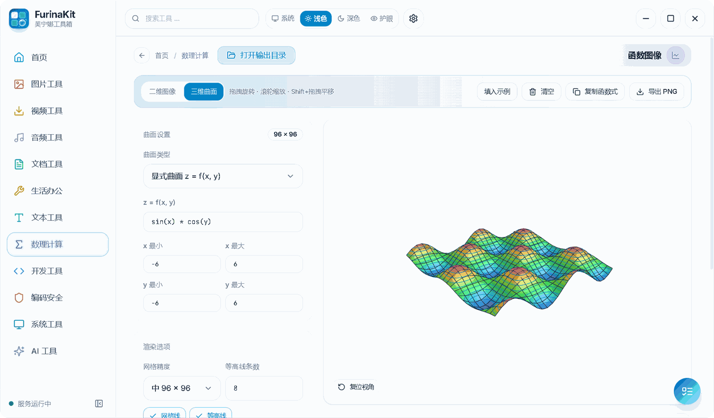
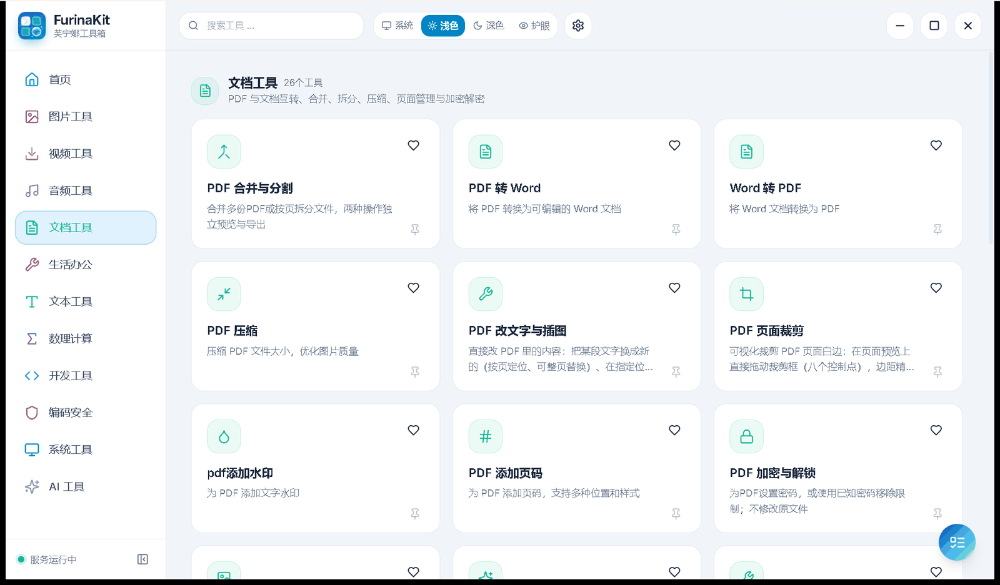
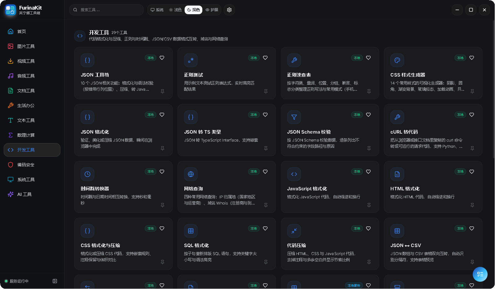

<p align="center">
  
</p>

<h1 align="center">FurinaKit（芙宁娜工具箱）</h1>

<p align="center">
  <strong>全能 · 纯净 · 高效的一站式轻量工具箱</strong><br>
  220+ 款实用工具 · 无需登录 · 无广告 · 免费开源
</p>

<p align="center">
  <a href="#-功能亮点">功能亮点</a> •
  <a href="#-界面预览">界面预览</a> •
  <a href="#-工具一览">工具一览</a> •
  <a href="#-下载与安装">下载安装</a> •
  <a href="#-从源码构建">源码构建</a> •
  <a href="#-隐私说明">隐私说明</a>
</p>

<p align="center">
  
  
  
  
  
  
</p>

---

## 📖 简介

**FurinaKit** 是一款以《原神》芙宁娜为设计灵感的 Windows 桌面工具箱。

平时处理图片、PDF、音视频、文本、计算、开发调试这些零碎的事，往往要装一堆小软件，或者去找满是广告、要登录、还限制文件大小的网站。FurinaKit 把 **220+ 款常用工具**放进一个软件里：打开就能用，不用注册，没有广告，工具箱本体免费使用。

v2.1.0 从 Electron 换成了 **Tauri v2 + Rust**，常用工具已改为原生实现，不再需要随包附带 Python 环境。

---

## ✨ 功能亮点

| | |
| :--- | :--- |
| 🧰 **220+ 款工具** | 分成 11 个板块：图片、视频、音频、文档/PDF、生活办公、文本、数理计算、开发、编码安全、系统、AI |
| 🚪 **打开就能用** | 不用注册，也不用登录账号 |
| 🚫 **无广告** | 没有弹窗和推广，也不捆绑其他软件 |
| 🔒 **本地文件处理** | 离线图片、文档、音视频任务在本机完成；主动使用在线服务或提交反馈附件时另行联网 |
| 🔍 **搜索、收藏、热门** | 首页可以搜索工具、收藏常用工具，还能看到热门工具 |
| 🎈 **桌面悬浮球** | 把文件拖到悬浮球上就能打开对应工具，也可以自定义全局快捷键 |
| 🎨 **三种主题** | 浅色、深色、护眼，可跟随系统 |

---

## 🖼️ 界面预览

### 首页（浅色 / 深色 / 护眼）

<p align="center">
  
</p>

<p align="center">
  
  
</p>

### 函数图像（三维曲面）

输入 `z = f(x, y)` 即可画出曲面，可以拖动旋转、滚轮缩放，并导出 PNG。也支持二维函数图像。

<p align="center">
  
</p>

### 特色工具

**跨设备互传**：手机和电脑连同一个 Wi-Fi，手机扫码就能互传文件、同步剪贴板，手机上不用装 App。

<p align="center">
  
</p>

**批量重命名**：用 `{name}`、`{seq}`、`{date}` 等标签组合出新文件名，改名前可以先预览效果。

<p align="center">
  
</p>

**批量图片查重**：找出文件夹里重复或相似的图片，改过名、压缩过、裁剪过、加了水印的也能认出来。

<p align="center">
  
</p>

**图片高清强化**：用 Real-ESRGAN 模型把图片放大 2 倍或 3 倍，一次最多处理 50 张。可以拖动中间的滑块对比放大前后的效果。

<p align="center">
  
</p>

### 分类页

<p align="center">
  
  
</p>
<p align="center">
  
  
</p>

---

## 🧰 工具一览

当前版本共 **229** 款工具，各板块数量与软件内显示一致：

| 板块 | 数量 | 部分工具 |
| :--- | :---: | :--- |
| 🖼️ 图片工具 | 36 | 图片压缩、格式转换、图片抠图、图片高清强化、AI 扩图、黑白上色、去水印、图片混淆、批量图片查重、文件伪装为图片 |
| 🎬 视频工具 | 13 | 视频下载、B 站视频提取、磁力种子下载、视频转 GIF、视频压缩、录屏 |
| 🎵 音频工具 | 13 | 音频格式转换、提取音频、音频剪切与合并、人声分离、音频降噪 |
| 📄 文档工具 | 26 | PDF 合并与拆分、PDF 转 Word、Word 转 PDF、PDF 压缩、PDF 页面裁剪、PDF 加水印、添加页码、加密与解锁 |
| 🎈 生活办公 | 45 | 跨设备互传、便签、时间管理（时钟/倒计时/闹钟/秒表）、思维导图、批量重命名、电子签名 |
| 📝 文本工具 | 17 | 文字与数字转换、字数统计、文本对比、查找替换、繁简转换 |
| 📊 数理计算 | 18 | 科学计算器、函数图像（二维/三维）、高等数学运算、几何计算器、单位换算 |
| 💻 开发工具 | 29 | JSON 工具箱、正则测试、正则速查表、JSON 格式化、JSON 转 TS 类型、CSS 样式生成器、cURL 转代码、时间戳转换 |
| 🔐 编码安全 | 17 | 哈希校验、Base64 / URL 编解码、JWT 解析、加密解密 |
| 🖥️ 系统工具 | 10 | 设备概况、处理器与内存、显卡与显示器、硬盘健康、网络适配器、电源与温度、占用空间排查 |
| 🧠 AI 工具 | 5 | AI 生成 PPT、文本润色、翻译、公文写作、表格生成 |

> 少数 AI 类功能（如抠图、超分）第一次使用时需要下载模型组件，软件会提示你下载。

---

## 📦 下载与安装

**系统要求**：Windows 10 / 11（64 位）。需要 Microsoft Edge WebView2 运行时，Windows 10/11 通常已自带。

前往 **[Releases 发布页](https://github.com/FUFU-eng/FurinaKit/releases/latest)** 下载：

| 文件 | 说明 |
| :--- | :--- |
| `FurinaKit.Setup.2.1.0.exe` | 安装版（推荐），约 115 MB |
| `FurinaKit-v2.1.0-windows-x64.zip` | 免安装版，解压后运行 `FurinaKit.exe`，约 143 MB |

从 2.0.6 升级到 2.1.0 使用**完整安装包**，不能使用旧的 Electron 增量补丁。软件内检查更新会按发布清单选择完整包并启动安装向导。升级前请完成正在进行的任务；手动运行安装包时，先从托盘退出旧客户端。安装程序会检测旧安装位置，新版会只读导入支持的旧版设置、收藏及工具数据，不覆盖已有的新配置。

---

## 💻 从源码构建

需要：Windows 10/11 x64、Node.js 24 LTS、Rust 稳定版、Visual Studio 2022 C++ 生成工具（MSVC x64）及 Python 3.11+。本次构建使用 Rust 1.97.1；Python **仅用于开发时校验和装配资源，不是软件运行依赖**。

```bash
git clone https://github.com/FUFU-eng/FurinaKit.git
cd FurinaKit

# 获取并校验固定版本的基础资源（不下载设置中的按需模型）
python scripts/fetch_build_resources.py

# 安装依赖并构建前端
npm --prefix web ci
npm --prefix web run build

# 构建内嵌前端的桌面程序
cargo build --manifest-path src-tauri/Cargo.toml --release --locked --features desktop-gui,tauri/custom-protocol --bin furinakit-desktop

# 装配完整便携目录，避免只运行缺少引擎/DLL 的裸 exe
python scripts/assemble_desktop.py --output release-work/local-desktop/FurinaKit
```

---

## 🔒 隐私说明

- **离线文件任务**：图片、PDF、音视频等离线工具在本机处理，不会自动上传处理文件。
- **主动联网功能**：视频/网页下载、在线翻译、在线 AI、模型下载以及手动提交反馈会联系相应服务。反馈中主动添加的图片会随反馈上传，请勿附带敏感信息。
- **统计与更新**：应用会发送匿名安装次数、启动次数和工具使用次数，并检查更新与反馈回复；统计不包含文件内容、路径或文件名。设备详情和错误明细保存在本机。可通过 `FURINAKIT_DISABLE_TELEMETRY=1` 禁用匿名计数。
- **按需模型**：设置中列出的抠图、修复、语音等可选模型不随安装包捆绑，下载时校验文件大小及 SHA-256。基础 OCR、轻量超分和音视频运行资源则随包提供。

---

## 📄 许可证与致谢

工具箱本体以 [MIT License](LICENSE) 开源；第三方引擎、模型与程序分别遵循各自许可，不因此统一变为 MIT。ARCHPR 为第三方商业软件，无授权环境使用 Trial；本项目不提供或转移激活信息。

感谢这些开源项目：[Tauri](https://tauri.app/)、[FFmpeg](https://ffmpeg.org/)、[yt-dlp](https://github.com/yt-dlp/yt-dlp)、[PaddleOCR](https://github.com/PaddlePaddle/PaddleOCR)、[Real-ESRGAN](https://github.com/xinntao/Real-ESRGAN)、[whisper.cpp](https://github.com/ggerganov/whisper.cpp)、[aria2](https://aria2.github.io/)、[DirectML](https://github.com/microsoft/DirectML)。完整的第三方许可证见 [THIRD_PARTY_NOTICES.md](THIRD_PARTY_NOTICES.md)。

## ⚠️ 免责声明

本项目为粉丝自制的非商业开源软件，与米哈游（miHoYo / HoYoverse）没有任何关联。《原神》及「芙宁娜」相关的角色、名称和美术素材的版权归米哈游所有。

---

<p align="center">
  觉得好用的话，欢迎点个 Star ⭐。有问题或建议，欢迎提 Issue。
</p>
